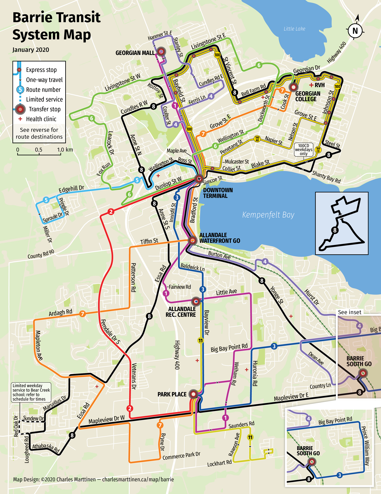

+++
title = "An update to my Barrie Transit map"
date = 2020-12-04
image = "thumbnail.png"
aliases = ["/map/barrie"]
featured = true
+++

Ever since I finished my re-drawing of Barrie's transit map a year-and-a-half ago (see [Re-drawing the Barrie Transit map](/posts/barrie-transit-map.html), April 2019), I always knew it could still be improved. It was my first map, and after years of working on it I finally had to just call it done.

However, I decided recently that it was due for an update. Some of the routes changed significantly earlier this year, and I wanted to see how I could improve the map as a whole. I still hold to the main principles I set out in my first post, but upon some reflection I decided that some specific design choices I made didn't work very well.

<!--more-->

Here's the pocket map (PDF download links are at the end). Below that are some of the problems I identified with the map, what I changed, and why.

## Problem 1: It's still difficult to trace lines through crowded transfer stops

One of my rules in part 1 was that "routes must be easily traceable", but looking back now, my "x-ray lens" solution for cramped parts of the map ultimately falls short of this goal. So I took a step back, and concluded that the precise roads that buses travel on in the small area of the downtown core matters much less than the ability to easily trace individual route lines along their full lengths.

Notably, I said that "The area within the box is small enough that we can rely on users to use simple deduction to determine where exactly routes run", which I don't think is necessarily true. I'm intimately familiar with this map, and even I still feel like the "x-ray lens" is a (small) obstacle to understanding it.

The solution? Go back to what's normal: simply make the route lines thinner so they can fit, and pay careful attention to line placement to minimise confusion. Importantly, none of the lines overlap underneath the transfer stop dot (except route 8, which is unique).

This was made possible by simply changing the order in which parallel lines are drawn on the rest of the map so that the lines match up on either side of the Downtown Terminal. For example, see how route 100 is completely contained within the northern loop of route 8, which is a change from my old map (and radically different from the official map). There was also a bit of luck involved in how it worked out so cleanly.

The slightly swooping, string-like character of the route lines as they approach the Downtown Terminal was a deliberate design decision intended to convey the feeling of "not to scale here".

Because of route 8's unique self-intersecting route, I cut-out the middle of the transfer stop dot so that you can see how it crosses itself. Also, route 8 takes a swooping approach to the dot so that the lines cross at right angles, which makes this even more clear. But I still kept the diagram of route 8's figure-eight to make it absolutely clear how route 8 works.

. A bit chaotic.")

## Problem 2: The express route 100 isn't as clear as it could be

I didn't like the multi-coloured, dashed route line I used for express route 100, and there was no indication on the map that express service is also twice as frequent as other routes.

To fix this, I've depicted route 100 as the two routes that it actually is, 100AB and 100CD, as two lines in the same colour running alongside each other. 100AB and 100CD now diverge along a part of their routes, so it is now obvious which parts get doubly-frequent service, and when it reverts to normal service (100CD only operates on weekdays, as stated in a bubble on the map).

I don't know if I've seen this pattern (doubling of route lines) used for express routes before, so we'll see what I think about it a year from now.

Regarding colour, I chose yellow simply because it was available. I don't think express routes need any special treatment, so I kept it solid like the other route lines.

## Problem 3: The route destination diagrams aren't explicit enough

It's implied that _A_ buses drive _towards_ A, not away from A, but this is not made explicit. Most people will know this, but not all.

The solution is simple: add arrows.

## Fin

All together, this is a pretty minor update to the map. It retains the character and design elements of the original, but it's somewhat easier to use.

The new map is available as a flattened PDF, in both pocket and poster sizes.
Except where permission has been otherwise granted, this map:

-   May be used for personal, non-commercial purposes only.
-   Must not be distributed from any other location except this page.

Download links:

-   [Tabloid poster (11" x 17")](/static/barrie-transit-tabloid-poster.pdf)
-   [Two-sided pocket map (8.5" x 11")](/static/barrie-transit-pocket-map.pdf)
